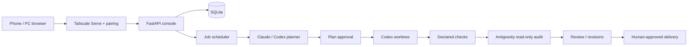

# RelayForge

**A self-hosted work console for Claude Code, Codex, and Antigravity on Windows**<br>
*Plan, implement, audit, and review development jobs from a private web interface.*


### Overview

RelayForge coordinates development jobs on registered local Git repositories. Claude Code prepares plans, Codex implements changes in a separate worktree, declared checks verify them, and Antigravity audits in read-only mode. The owner reviews results and explicitly approves sensitive delivery operations. SQLite preserves projects, jobs, events, diffs, findings, and decisions.

> [!NOTE]
> **Early Development:** The console has been exercised with synthetic agents. Acceptance with all real CLIs, the current Docker deployment, physical mobile devices, and restart recovery remains incomplete. The latest independent audit approved local Python and web quality gates. Docker runtime, real-provider jobs, physical mobile checks, and restart recovery remain unverified. See [verification status](docs/testing.md). There is no stable release or production-readiness claim.

The laptop is the host that remains powered on. A phone or another PC connects through the owner's private Tailscale network and pairing. Closing the browser leaves the host workflow running; powering off or suspending the host interrupts execution.

### Operational Workflow

1. Register a trusted Git repository or create a project under the configured projects root.
2. Open **Nueva tarea**, describe the change, and choose valid models for planning, implementation, and audit.
3. Review and approve the plan before implementation for a task created through the project UI.
4. Inspect worktree changes, checks, audit findings, and any revision cycle.
5. Approve only the delivery operation you intend to execute. A completed local job does not necessarily mean a commit or push occurred.

After a recognized quota/authentication failure, planning can switch from Claude to Codex while preserving the job and worktree. Selection follows the stage; Antigravity remains the auditor. Quota windows display as unknown when the provider does not expose them. The chat remains available for consultation; repository changes use Jobs.

### Key Engineering Decisions / Architecture

- **Projects and persistent jobs:** SQLite stores repository registrations and work history.
- **Separate worktrees:** each implementation uses its own worktree and `agent/job-N` branch.
- **Explicit handoff:** planner changes preserve context and create a compatible provider session; models are passed per invocation.
- **Independent audit:** enumerated reads/checks, source hashes, and a fail-closed gate. Denied tools or missing checks cannot count as approval.
- **Human delivery decisions:** the Core executes policy-controlled Git operations; approvals are scoped and can be invalidated by changed work.
- **Windows supervision:** Job Objects, process identity, heartbeat, and reconciliation manage agent lifetimes.
- **Private access:** Tailscale Serve, pairing, exact allowlists, and Host/Origin/CSRF checks.
- **Persistent container data:** separate runtime, workspace, project, Claude/profile, and Codex volumes. Authentication is checked in the actual execution environment.



Worktrees separate Git changes; they are not an operating-system sandbox. Register repositories and checks that you trust. See [SECURITY.md](SECURITY.md).

### Tech Stack

| Layer | Technologies |
| :--- | :--- |
| Backend | Python 3.13+ · FastAPI · Pydantic · Uvicorn |
| Storage | SQLite · SQLAlchemy · Alembic |
| Frontend | React · TypeScript · Vite · TanStack Query · React Router |
| Agents | Claude Code · Codex CLI · Antigravity CLI |
| Execution | Git worktrees · Windows Job Objects · psutil |
| Access | Tailscale Serve · pairing · session/CSRF checks |
| Verification | pytest · Ruff · mypy · Vitest · ESLint · TypeScript · browser QA |
| Packaging | Docker Compose · Windows Server Core · Hyper-V isolation |

### Requirements

- Trusted Windows host, Git, and supported agent CLIs authenticated in the execution context.
- Python 3.13+, `uv`, Node.js 24, and npm for the development setup below.
- Tailscale on the host and remote client for private access.
- For Docker: Windows containers mode, Hyper-V and Containers enabled, and a compatible host. The current runtime does not run in a Linux container.
- Workspace, projects root, exact allowed Tailscale identities, and allowed HTTPS hosts configured before startup.

### Quickstart

The project currently targets source checkouts; clean third-party installation still requires acceptance testing.

```powershell
git clone https://github.com/FerS00/RelayForge.git
Set-Location RelayForge
uv sync --locked --all-groups
npm --prefix web ci
npm --prefix web run build
```

Create `%LOCALAPPDATA%\RelayForge\config\settings.yaml` using [Windows installation](docs/install-windows.md), then run:

```powershell
uv run relayforge doctor
uv run relayforge serve
```

Configure Tailscale Serve for the exact local port. In another terminal, generate a one-use code with `uv run relayforge token pair`. Open the host's HTTPS tailnet address on the allowed device and pair. Keep the host running. Do not publish codes, credentials, runtime logs, or fingerprints.

For Docker follow [Docker on Windows](docs/docker-windows.md), including private NAT, loopback portproxy, volumes, and provider logins. A host repository path is not automatically mounted into the container.

### Development & Verification

```powershell
uv sync --all-groups
npm --prefix web ci
npm --prefix web run build
uv run ruff check src tests
uv run ruff format --check src tests
uv run mypy src/relayforge
uv run pytest -q
npm --prefix web run lint
npm --prefix web run typecheck
npm --prefix web run test
npm --prefix web run build
```

Automated tests use synthetic agents without invoking real agent CLIs; real authentication and physical-device acceptance are separate checks. See [CONTRIBUTING.md](CONTRIBUTING.md) and [current results](docs/testing.md). CI is configured; check the remote result for each published revision.

### Documentation & Roadmap

| Document | Purpose |
| :--- | :--- |
| [Documentation index](docs/README.md) | Current guides and historical specifications |
| [Project plan](docs/PLAN_PROYECTO.md) | Scope, decisions, detailed phases, acceptance, and rollback |
| [Working checkpoint](docs/ESTADO_TRABAJO.md) | Verified local state and next action |
| [Projects and jobs](docs/usage.md) | Tasks, models, handoffs, and human decisions |
| [Architecture](docs/architecture.md) | Modules, data, API, and boundaries |
| [Windows installation](docs/install-windows.md) | Native setup and startup limitations |
| [Windows Docker](docs/docker-windows.md) | Container setup, persistence, and status |
| [Testing](docs/testing.md) | Executed checks and remaining acceptance |
| [Git preparation](docs/publication.md) | About/topics, publishable files, and blockers |

The revised roadmap awaits approval: close console acceptance → validate Docker and real mobile execution → onboard another real project → verify recovery/data → prepare a reviewed public candidate → finish visual design and PWA. Design follows functional acceptance.

### Troubleshooting

| Symptom | Check |
| :--- | :--- |
| `authentication_required` / pairing page | Pair with a fresh code and allowed identity. Provider login is separate. |
| `Identidad no permitida` | Check exact login/Host allowlists and trusted Serve/proxy path. Replacing the code alone does not fix identity validation. |
| Job paused by quota/auth | Check the stage and select a compatible available agent/model; no reset time is assumed. |
| Host path missing in Docker | Use a repo visible inside the container; agree on the target before adding a mount/copy. |
| Web unavailable after closing terminal | Confirm the host service/container is running and Serve has a live backend. |
| Audit approved but gate denies a tool | Treat the audit as blocked and inspect its evidence. |

### License

Apache-2.0. See [LICENSE](LICENSE). Provider accounts and model access remain subject to their respective services.
