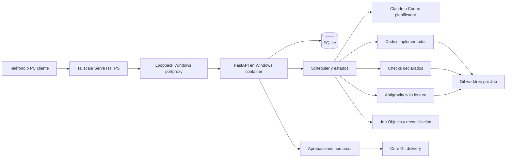

# RelayForge — Plan del proyecto

## Control del documento

- Estado del producto: **desarrollo temprano (Early Development)**. No se declara una versión estable, un MVP aceptado ni disponibilidad continua demostrada.
- Estado de esta revisión: **Borrador pendiente de aprobación**. La redacción solicitada no aprueba automáticamente las nuevas fases.
- Actualizado: 2026-10-05.
- Fuente canónica: `docs/PLAN_PROYECTO.md`.
- Responsable de aprobación: propietario del proyecto.
- Base: repositorio local, especificaciones de Fases 0–10, `CONSOLA_OPERATIVA.md`, pruebas y auditorías disponibles.
- Historial preservado: [plan anterior](archive/PLAN_PROYECTO_2026-10-05_PREVIO.md). Sus estados y ejemplos son históricos; este documento gobierna la planificación vigente.

Estados de fase: `Pendiente de aprobación`, `Aprobada`, `En curso`, `Bloqueada`, `Completada`. Una fase solo se cierra con evidencia de sus criterios; tener código o una imagen construida no demuestra aceptación operativa.

## 1. Objetivo y resultado esperado

RelayForge será una consola web privada para ejecutar trabajos de desarrollo sobre repositorios Git de un host Windows. El propietario podrá iniciar una tarea desde el teléfono, revisar su plan, aprobar la implementación y volver después para consultar cambios, checks, hallazgos y entrega. El trabajo continúa en el host con el navegador cerrado.

La laptop será el host que permanece encendido. El teléfono y la PC de uso diario son clientes. Si el host se apaga, suspende o pierde conectividad, la ejecución se detiene; recuperarse después del arranque es un requisito distinto de trabajar sin host disponible. No se propone contratar infraestructura externa ni migrar el runtime a Linux en esta revisión.

El flujo habitual es Claude planificador → Codex implementador en worktree → checks declarados → Antigravity auditor de solo lectura → aprobación humana de las operaciones de entrega. El relevo de planificación a Codex será explícito y conservará Job, solicitud, historial y worktree. La selección de agente no permitirá que un implementador apruebe su propio trabajo.

## 2. Alcance confirmado con el propietario

| Capacidad | Alcance | Resultado y límite |
|---|---|---|
| Consola por proyectos | Incluido | Registrar repositorios existentes o crear repositorios locales; navegar sus Jobs persistentes. |
| Trabajo desde el móvil | Incluido | Navegador por Tailscale; pairing y allowlists exactas. |
| Ejecución real | Incluido | CLIs autenticadas en el contexto donde corre el servicio; no se reemplazan por respuestas simuladas en uso real. |
| Selección por turno | Incluido | Agente/modelo compatibles con la etapa; cambio en una pausa o antes de aprobar el plan. |
| Continuidad por cuota/auth | Incluido | Error visible, intervención del propietario y relevo permitido; no inventar reinicios de cuota. |
| Auditoría independiente | Incluido | Lecturas/checks enumerados, gate fail-closed y hallazgos persistentes. |
| Git worktrees y concurrencia | Incluido | Una rama y worktree por Job; límites y aviso de solapamientos. |
| Commit/push | Incluido bajo aprobación | Core ejecuta solo operaciones autorizadas; sin merge automático, force push ni escritura a rama protegida. |
| Otro proyecto real del propietario | Incluido en fase dedicada | Seleccionar repositorio y checks concretos antes de ejecutar; no importar un árbol arbitrario del host. |
| Docker | Incluido | Windows containers con Hyper-V y datos persistentes; la imagen actual no hace portable el runtime a Linux. |
| Diseño final y PWA | Diferido al final | Después de cerrar funcionalidad y validar el otro proyecto. |
| Chat de consulta | Secundario | Ruta existente de consulta; las tareas con cambios se gestionan como Jobs. |
| Multiusuario, RBAC, Internet público | Excluido | Un propietario por tailnet; sin Funnel ni servicio público. |
| Terminal remota libre, IDE web | Excluido | No se entrega una PTY arbitraria ni un editor completo en la web. |
| Nuevos proveedores, bots, apps nativas | Diferido | Requieren alcance y aprobación propios. |

### Evidencia de éxito para el propietario

Desde un teléfono emparejado: abrir un proyecto → crear una tarea → elegir modelos válidos → aprobar el plan → cerrar el navegador → volver y revisar resultados reales → aprobar únicamente la entrega deseada. Una pausa por cuota debe poder retomarse sobre el mismo Job/worktree. Una auditoría rechazada o bloqueada nunca habilita una entrega como aprobada.

## 3. Lo que existe actualmente

La siguiente tabla describe el checkout de desarrollo. No garantiza que el contenedor activo incluya sus últimos cambios.

| Área | Código y archivos observados | Evidencia actual | Pendiente |
|---|---|---|---|
| Web | React, HashRouter, proyectos, Jobs, modelos, diff, aprobaciones, agentes y métricas | 18 pruebas web; lint, tipos y build pasan | Uso real desde teléfono sobre la revisión nueva. |
| API | FastAPI; rutas de repositorios, Jobs, dispatch, auth, approvals y diagnóstico | Pruebas de integración con dobles | Compatibilidad operativa con las CLIs en el contenedor. |
| Persistencia | SQLite, SQLAlchemy y migraciones `0001`–`0008` | Suite de migración/integración pasa | Backup/restauración con los datos de despliegue. |
| Workflow | Plan, worktree, implementación, checks, auditoría, triage, revisión y entrega | Pruebas automatizadas con fakes | Cadena real completa y autorización de entrega a remoto de prueba. |
| Relevo | `WAITING_AGENT`, selección versionada, planner Codex read-only, modelo por invocación | Cuota/auth simuladas; navegador con mismo Job, rama y worktree | Auth/cuota reales y errores emitidos antes del stream JSON. |
| Supervisión | Job Objects, PID/create_time, cancelación, watchdog y reconciliación | Pruebas automatizadas | Reinicio físico con Job activo y credenciales bajo el modo elegido. |
| Seguridad | Pairing, Host/Origin/CSRF, proxy confiable, redacción, políticas y gate auditor | Suites y auditorías históricas | Gates finales de publicación y revisión de límites de aislamiento. |
| Docker | Server Core LTSC 2019, Hyper-V; tres CLIs incluidas en imagen nueva | Build local terminado; Engine Windows recuperado | Rebuild final, recreación y login/verificación de Codex/Antigravity dentro del contenedor. |
| CI | Workflow Python Windows, web y seguridad | Archivo inspeccionado | Ejecución remota después de un push autorizado; no se declara verde. |

### Resultado de verificación más reciente

- Auditoría correctiva `e07678935a1f49acb1d867add49bf39d`, Antigravity `gemini-3.8-flash-high`, esfuerzo `high`: **APROBADO** para gates locales; 50/50 comandos, cero denegaciones, omisiones o cambios del auditor. Evidencia resumida en `docs/evidence/2026-10-05-console-correction.json`.
- Python: 139 pruebas pasaron y 1 se omitió por `WinError 1314` al crear symlink; los warnings de `Starlette/httpx` son de deprecación. Ruff check/formato y mypy pasan.
- Web: 12 archivos/18 pruebas; ESLint, TypeScript y Vite build pasan.
- El primer audit `56984be1120c4cbd8ff9aeca093c4cf2` rechazó I001 y la llamada a `_agent` real en el test fingerprint; ambas correcciones pasan. El intento `5457f9fa71fa4b86be582a29ec77c0a7` queda invalidado por la acción `manage_task` denegada en su gate.
- La corrida incompleta `62eb5fe44c734ec6991d732800a23903` tampoco acredita aprobación.
- Navegador móvil emulado con API aislada y agentes sintéticos: proyecto, tarea, cuota simulada, relevo, aprobación, diff e historial tras recarga/reinicio del servidor comprobados; las vistas revisadas a 360 px no mostraron desbordamiento.
- No se verificaron en esta auditoría los logins reales, tarea Docker Windows, teléfono físico, recuperación tras reinicio ni CI GitHub. No implican cierre de fase ni aceptación operativa.
## 4. Decisiones preservadas y cambios aprobados

| ID | Decisión vigente | Tratamiento |
|---|---|---|
| D-01 | Repositorio/runtime fuera de carpetas sincronizadas como OneDrive | Preservada. |
| D-02 | Plan inicial y Fase 0 aprobados en 2026-10-02 | Histórica; no equivale a aprobación de esta revisión. |
| D-03 | RelayForge y nombre de distribución | Nombre usado; verificar disponibilidad antes de publicar paquetes. |
| D-04 | Repositorio público; no publicar datos personales ni secretos | Preservada; preparar documentación no autoriza push. |
| D-05 | Plantillas definen política de aprobación del plan | UI de proyecto exige aprobación mediante `require_plan_approval`; API antiguo conserva fallback si se omite. Documentar ambos. |
| D-06 | Pruebas reales sobre repositorio desechable separado | Preservada; remoto de prueba necesita autorización concreta. |
| D-07 | Evitar delegación global fuera del workflow | Mantener controles técnicos y confirmar comportamiento con los perfiles reales. |
| D-08 | Host laptop Windows | Preservada. Actualización del OS es una decisión operativa separada. |
| D-09 | Modo de arranque/autologin | Pendiente; no configurar autologin por deducción. |
| D-10 | Modelos/esfuerzo configurables | Identificadores admitidos por la cuenta/CLI, sin catálogo inventado. |
| D-11 | Push real bajo el modo de arranque elegido | Pendiente para la configuración vigente; una prueba antigua en otro checkout/modo no la sustituye. |
| D-12 | Fases originales 1–10 autorizadas en bloque | Conservada. Nueva fase = aprobación específica pendiente. |
| D-13 | Varios Jobs por repositorio | Worktrees/rama independientes, límites y aviso de conflictos. |
| D-14 | Crear y registrar repositorios locales | Incluido; crear repositorios remotos queda fuera. |
| D-15 | Interfaz inicialmente centrada en conversación | Sustituida por la instrucción explícita de consola de proyectos/Jobs del 2026-10-05. |
| D-16 | Contratos originales de chat/SSE/bind | Compatibilidad conservada; chat secundario, proxy Docker explícito. |
| D-17 | Docker Windows, interrupción/reinstalación/reinicio previamente autorizados | Configuración ejecutada históricamente; despliegue nuevo y autenticación siguen pendientes. |
| D-18 | Esta laptop permanece encendida como host | Confirmada por el propietario. PC cliente apagada no impide el trabajo si el host sigue disponible. |
| D-19 | Funcionalidad primero; otro proyecto antes del diseño final | Confirmada por el propietario. Reubica la antigua Fase 11 visual a Fase 16. |
| D-20 | Documentación para Git y estado de desarrollo temprano | Redacción/preparación autorizadas; nuevas fases en borrador. |

## 5. Requisitos verificables

| ID | Requisito | Evidencia de aceptación |
|---|---|---|
| RF-01 | Crear/registrar proyecto y mostrar diagnóstico Git | Nombre, repositorio habilitado, rama base y checks declarados; errores visibles. |
| RF-02 | Historial por proyecto persistente | Recarga y reinicio conservan Jobs, solicitud, fases, worktree y eventos. |
| RF-03 | Despachar agente/modelo compatible por etapa | Modelo llega a argv separado y al registro del Job; 409 en etapa activa/versión obsoleta/rol incompatible, 422 en cuerpo inválido. |
| RF-04 | Relevo Claude→Codex de planificación/triage | Misma identidad y worktree; nueva sesión del proveedor, sin reutilizar un thread de implementación como planificación. |
| RF-05 | Aprobación antes de implementación de una tarea creada desde proyecto | No hay cambios del implementador antes de aprobar; rechazo no lanza ejecución. |
| RF-06 | Codex implementa en worktree | Rama `agent/job-N`, diff y archivos capturados; árbol principal preservado. |
| RF-07 | Checks declarados y acotados | argv sin shell, timeout, resultados/errores persistentes; timeout termina descendientes. |
| RF-08 | Auditor independiente | Herramienta denegada, cambio de hash o check faltante ⇒ bloqueo; no autoaprobación. |
| RF-09 | Correcciones limitadas | Hallazgo→triage con motivo→brief acotado; máximo tres iteraciones por Job. |
| RF-10 | Entrega autorizada | Decisión vinculada a operación/scope/snapshot; se invalida si cambia el worktree; sin force push/merge protegido. |
| RF-11 | Recuperación segura | PID y creación verificables; sin proceso huérfano, repetición de entrega ni Job activo sin proceso tras reconciliar. |
| RF-12 | Diagnóstico y consumo honestos | Versiones/auth verificadas; turnos/tokens de eventos; cuota desconocida cuando no la expone el proveedor. |
| RF-13 | Acceso privado | Dispositivo emparejado y login exacto; pruebas negativas de identidad, Host, Origin y CSRF. |
| RF-14 | Datos persistentes y restaurables | Restauración sobre entorno de prueba conserva Jobs/aprobaciones sin copiar credenciales a Git. |
| RF-15 | Servicio independiente del navegador | Cerrar teléfono/navegador no termina el proceso del host; después se recupera la traza. |

Requisitos no funcionales: Windows soportado por el runtime; errores visibles sin secretos; timeouts/cancelación acotados; versiones/migraciones reproducibles; no escritores simultáneos sobre un mismo Job; accesibilidad de controles críticos en móvil. No se fija una disponibilidad porcentual ni latencia garantizada sin medir una carga real.

## 6. Arquitectura y límites

En ejecución nativa, FastAPI enlaza loopback. En Docker Windows enlaza `0.0.0.0` dentro del contenedor y solo confía en el gateway NAT configurado. Compose no publica puertos; el puente del host escucha únicamente loopback y Serve reenvía allí. No atribuir al worktree aislamiento del sistema operativo: los procesos mantienen los permisos efectivos de su contexto de ejecución.

| Área | Responsabilidad | Fuente |
|---|---|---|
| API/auth | Sesión, pairing, CSRF, Host/Origin y contratos REST | `src/relayforge/api/` |
| Core | Jobs, fases, locks, checks, triage, políticas y entrega | `src/relayforge/core/` |
| Adapters | argv por invocación y normalización de salida | `src/relayforge/adapters/` |
| Process/platform | Árboles de procesos Windows, heartbeat y reconciliación | `process/`, `platform/` |
| Git | Repositorios, worktrees, diff y operaciones aprobadas | `src/relayforge/git/` |
| DB | Modelos, texto redactado y migraciones | `src/relayforge/db/` |
| Web | Proyectos, Job workspace, selecciones y decisiones humanas | `web/src/` |
| Config | Esquemas JSON, workflows y políticas versionados | `config/` |

### Estado y datos

`Job` conserva repositorio, solicitud, workflow, planificación/modelos, etapa pausada, estado/version, rama/base SHA/worktree, thread Codex, diff, iteraciones y errores. `JobStep` conserva actor, intento, proceso y resultado. Eventos, hallazgos, triage, aprobaciones y grants se relacionan con el Job. Las sesiones de pairing y los perfiles de proveedores son dominios separados.

Estados activos: `PREPARING`, `PLANNING`, `IMPLEMENTING`, `TESTING`, `AUDITING`, `TRIAGING`, `REVISING`, `FINAL_REVIEW`, `DELIVERING`. Pausas: `WAITING_APPROVAL`, `WAITING_AGENT`, `WAITING_RETRY`, `INTERRUPTED`. Terminales: `COMPLETED`, `FAILED`, `CANCELLED`. `COMPLETED` puede significar resultado local sin push si no existe operación de entrega configurada; la UI/documentación deben evitar confundirlo con publicación.

Cuota/auth reconocidas llevan a `WAITING_AGENT`. El retry automático está reservado al fallo de red reconocido y es limitado. No convertir un 429 en una hora estimada de recuperación. El cambio de agente/modelo comprueba versión y etapa antes de encolar.

### Contratos actuales relevantes

| Ruta | Contrato vigente |
|---|---|
| `POST /api/repos` | Crear repositorio local bajo `projects_root` o registrar ruta existente; checks como JSON argv. |
| `GET /api/repos` | Repositorios, estado Git, rama y checks. |
| `POST /api/jobs` | `request_text`, título opcional, repositorio/workflow, `agent`, `model`, modelos de implementación/auditoría, `require_plan_approval`; Idempotency-Key. |
| `GET /api/jobs?repository_id=...` | Historial filtrado persistente. |
| `GET /api/jobs/{id}` | Estado, versiones, etapas, eventos, plan, diff y hallazgos. |
| `POST /api/jobs/{id}/step` | `version` obligatoria y agente/modelo opcionales; no reemplaza la aprobación de plan. |
| `POST /api/jobs/{id}/cancel` / `resume` | Cancelar árbol o reanudar/reintentar una etapa interrumpida. |
| `GET /api/jobs/{id}/events` / `/api/stream` | SSE y replay; detalle de cursor según contrato de cada flujo. |
| `GET /api/agents/status` | Probes seguros, salud, modelos configurados y consumo medido; auth Antigravity puede ser UNKNOWN. |
| `GET /api/approvals`; `POST /api/approvals/{id}/decision` | Decisiones con scope según contrato; operación/version/snapshot revisables. |
| `/api/auth/*`, `/api/doctor`, `/api/metrics/summary` | Pairing/sesión/CSRF, diagnóstico y métricas de Jobs. |

No existe en esta revisión una promesa de API de importación desde GitHub, upload general, alternancia libre de los tres agentes para implementar ni cuotas completas de cuentas. Se planifican solo capacidades solicitadas y compatibles con los roles.

## 7. Seguridad, configuración y despliegue

Credenciales de CLIs se crean por login en su entorno real y quedan fuera de imagen, código y documentación pública. La configuración contiene rutas, identidades permitidas y modelos; no tokens. Los ejemplos usan identidades `.test` y rutas genéricas. No se leen perfiles privados para fabricar un panel de cuota.

El gate auditor debe revisar también su registro de decisiones, aunque la CLI finalice con SUCCESS. Una aprobación textual no invalida una denegación. Los checks autorizados pueden producir artefactos locales normales pero no editar fuentes ni escribir recursos externos. Mantener el límite de tres correcciones sin cambiar de auditor para eludir un rechazo.

La imagen actual contiene Claude Code 2.1.288, Codex 0.159.2 y Antigravity 1.2.16; esto acredita instalación/build, no disponibilidad de modelos ni autenticación completa. Compose declara cinco volúmenes; el contenedor antiguo observado usa cuatro. Los repositorios de Docker deben existir en rutas visibles dentro del contenedor. Registrar una ruta del host no monta sus archivos automáticamente.

La restauración debe separar base de datos/worktrees/proyectos de perfiles de agente. No eliminar volúmenes ni asumir que un mecanismo de credenciales del OS sobrevivirá a recrear un contenedor: verificar cada proveedor después.

## 8. Roadmap original y evidencia conservada

| Fase original | Resultado histórico | Estado de cierre vigente |
|---|---|---|
| 0 | POCs y reservas de arranque/identidad/Git | Completada bajo criterios originales; reservas operativas no eliminadas. |
| 1 | Chat local y streaming Claude | Completada históricamente; entrada secundaria. |
| 2 | Jobs, estados, SQLite, SSE/reconciliación básica | Completada históricamente con auditoría. |
| 3 | Repositorios/worktrees/Codex/diff | Completada históricamente con dobles. |
| 4 | Pairing, acceso remoto, doctor y arranque | En curso en aceptación de dispositivos/configuración actual. |
| 5 | Checks declarados y resultados | Completada históricamente con dobles. |
| 6 | Auditoría, triage y revisión | Completada históricamente; no sustituye aceptación de CLIs reales. |
| 7 | Políticas, aprobaciones y entrega | Código auditado históricamente; push real de despliegue pendiente. |
| 8 | Cancelación/timeouts/recovery | En curso hasta pruebas físicas de reinicio/cancelación. |
| 9 | Workflows y métricas | Completada históricamente con dobles. |
| 10 | Hardening, CI, documentación y Docker añadido | En curso; gates de auditoría/publicación/operación no cerrados. |

Las especificaciones originales en `docs/specs/FASE_*.md` conservan detalle y evidencia de su momento. No se reetiquetan como totalmente cerradas por redactar esta revisión.

## 9. Nuevas fases propuestas

La antigua Fase 11 visual se desplaza a Fase 16 para respetar la prioridad funcional y la validación de otro proyecto. La corrección de consola ya fue autorizada e implementada parcialmente; la división siguiente propone su cierre y trabajo adicional. Todas estas fases quedan **Pendiente de aprobación** como fases de este plan revisado. No se ejecutan automáticamente desde esta petición de documentación.

### Fase 11 — Cerrar la consola operativa y sus gates locales

- Dependencias: código de Fases 2–10 y `CONSOLA_OPERATIVA.md`.
- Objetivo: convertir el checkout funcional en una revisión aceptada con error/relevo/modelos verificables.
- Áreas: adapters Claude/Codex, `core/jobs.py`, scheduler/workflow/audit, doctor, API/schemas, migración 0008, páginas de proyectos/Jobs/modelos y sus pruebas.
- Entregables: corrección I001; test fingerprint con doble; regresiones de error previo al JSON, modelos, dispatch/version y continuidad; especificación y reporte actualizados.
- Criterios: **11.1** Ruff/format/mypy/Python/web verdes; **11.2** cuota y sesión expirada, en JSON y stderr, ofrecen relevo; **11.3** mismo Job/branch/worktree antes/después; **11.4** rol incompatible, versión obsoleta o escritor activo ⇒ 409; **11.5** modelo seleccionado alcanza argv y persiste sin mutar el adaptador global; **11.6** ningún archivo de implementación antes de aprobación UI; **11.7** auditoría independiente limpia, sin acciones denegadas/checks omitidos; **11.8** cuotas desconocidas explícitas y ningún secreto expuesto.
- Pruebas: suites existentes con fakes; integración de migración/handoff/triage; navegador real móvil emulado del flujo proyecto→Job→pausa→relevo→aprobación→diff→historial.
- Riesgos: errores de CLI no estructurados, diferencias de `exec`/`resume`, carreras. Mitigar con fixtures representativos y controles de versión/etapa.
- Reversión: preservar worktrees/SQLite; usar revisión previa en un entorno de prueba; no hacer downgrade destructivo de datos automáticamente.
- Resultado esperado: auditoría APROBADO y consola local funcional; aún no implica aceptación real del host.
- Invocación: `$plan-driven-development Ejecuta únicamente la Fase 11 aprobada de docs/PLAN_PROYECTO.md; preserva el WIP y no publiques.`

### Fase 12 — Despliegue Windows Docker y prueba real desde móvil

- Dependencias: Fase 11; Docker Windows configurado; propietario disponible para login y pairing.
- Áreas: Dockerfile/Compose, instalación, perfiles/volúmenes, puente loopback, health/doctor y manual de operación.
- Entregables: imagen final identificada, contenedor recreado, migración 0008 activa, inventario de volúmenes y logins dentro del contenedor; reporte de una tarea real en repositorio desechable.
- Criterios: **12.1** build y config válidos; **12.2** health estable y HTTP local/HTTPS tailnet 200; **12.3** tres versiones ejecutables verificadas; **12.4** login real de cada proveedor sin copiar auth del host; **12.5** recreación conserva DB/Jobs/proyectos y se comprueba auth de nuevo; **12.6** móvil crea Job, aprueba plan y recibe diff/checks/auditoría reales; **12.7** cerrar navegador no cancela; **12.8** pairing inválido/identidad no permitida siguen rechazados.
- Pruebas: probes acotados, navegador real y teléfono físico; registrar comandos/resultados sin códigos de pairing ni tokens. Entrega remota excluida hasta autorización de fase correspondiente.
- Riesgos: autenticación interactiva, keyring Windows, IP NAT/portproxy y consumo de Hyper-V. No modificar firewall/identidades/Engine silenciosamente.
- Reversión: detener la revisión fallida y volver a imagen previa con volúmenes conservados y compatibilidad de schema verificada; no `down -v`.
- Resultado esperado: host operable desde móvil con un Job real completo y trazable.
- Invocación: `$plan-driven-development Ejecuta únicamente la Fase 12 aprobada; agrupa los logins y pruebas físicas que requieren al propietario.`

### Fase 13 — Incorporar y trabajar sobre otro proyecto real

- Dependencias: Fase 12; propietario identifica repo, rama base, tarea inicial y comandos permitidos.
- Áreas: registro/repositorios, paths visibles en Docker, checks y documentación de onboarding. Cambios de producto solo si una brecha observada requiere especificación aprobada.
- Entregables: proyecto objetivo registrado; contrato de acceso/copia/montaje concreto; check baseline; primera tarea pequeña y revisable.
- Criterios: **13.1** original preservado y ruta accesible por el runtime; **13.2** Git/branch/worktree comprobados; **13.3** solicitud tiene alcance y criterios cerrados; **13.4** dependencias/setup no se instalan sin autorización específica; **13.5** checks baseline se distinguen de regresiones; **13.6** plan aprobado→implementación→auditoría real→resultado local revisado; **13.7** no acceder a carpetas ajenas ni efectuar commit/push implícito; **13.8** reload devuelve historial vinculado al proyecto.
- Pruebas: comprobar target/dirty state; tarea acotada sobre worktree; ejecutar checks pactados y comparar baseline; revisión humana del diff.
- Riesgos: repositorios grandes, secretos, symlinks/submódulos, rutas largas y dependencias no preparadas. Detener solo la parte dependiente de información/configuración faltante.
- Reversión: conservar original y worktree; deshabilitar registro sin borrar archivos; rechazar entrega si el objetivo falla.
- Resultado esperado: RelayForge usado sobre el proyecto elegido por el propietario, antes de diseñar el aspecto final.
- Invocación: `$plan-driven-development Ejecuta únicamente la Fase 13 aprobada sobre el repositorio y la tarea expresamente identificados.`

### Fase 14 — Operación autónoma, recuperación y datos

- Dependencias: Fases 12–13 y decisión explícita del modo de arranque.
- Áreas: supervisor/reconcile/scheduler, retención, almacenamiento/backup, tareas de arranque y guía operativa.
- Entregables: matriz de recuperación real; procedimiento de backup/restauración; arranque verificado; límites de concurrencia y retención documentados.
- Criterios: **14.1** kill/reinicio del backend conserva historia y marca procesos interrumpidos; **14.2** reinicio físico con Job activo no deja activo sin proceso; **14.3** cancelación durante implementación/auditoría termina descendientes identificados; **14.4** resume/retry no duplican pasos o entrega; **14.5** cuota pausa hasta decisión explícita y red reintenta de forma limitada; **14.6** backup/restauración en entorno separado conserva trazabilidad; **14.7** dos Jobs del mismo repo usan worktrees distintos y muestran solapamientos; **14.8** `doctor` refleja disponibilidad real tras arrancar.
- Pruebas: repositorios desechables, fakes de procesos y pruebas físicas reales agrupadas; comprobar PID/create_time y eventos exactamente una vez donde corresponde.
- Riesgos: credenciales no interactivas, energía/suspensión, discos llenos, huérfanos. Cambiar configuración del host o reiniciar requiere autorización aplicable.
- Reversión: retirar tarea programada/configuración autorizada, volver a arranque manual y restaurar backup probado; conservar artefactos de trabajo.
- Resultado esperado: trabajo independiente del navegador, con recuperación demostrada y datos recuperables. No prometer ejecución con laptop apagada.
- Invocación: `$plan-driven-development Ejecuta únicamente la Fase 14 aprobada con los escenarios de recuperación y el modo de arranque acordados.`

### Fase 15 — Seguridad y preparación pública verificable

- Dependencias: Fases 11–14; documentación consistente; remoto de prueba y operaciones Git solo si se autorizan.
- Áreas: auth/proxy/policy/delivery/redacción, CI, artefactos de distribución y documentación pública.
- Entregables: reporte de seguridad y aceptación; inventario publicable sin secretos; guía de instalación en entorno limpio; manifiestos alineados; criterio de soporte temprano.
- Criterios: **15.1** pruebas negativas Host/Origin/CSRF/identidad desde otro dispositivo; **15.2** gate auditor fail-closed contrastado con su log; **15.3** aprobación inválida tras cambiar snapshot y denegación de force push/rama protegida; **15.4** paths/secret scan del conjunto publicable limpios; **15.5** lint/tipos/tests/build y escáneres pactados ejecutados; **15.6** GitHub Actions real en referencia publicada autorizada, o explícitamente No ejecutado; **15.7** setup desde entorno limpio documentado; **15.8** About/topics/README declaran Early Development y no stable/production-ready; **15.9** si se autoriza, commit/push de prueba funciona en el modo de arranque elegido y la operación queda trazada.
- Pruebas: escaneo estático primero; no fuzz/load/pentest activo sin target y autorización propios. CLIs reales fuera de suites automáticas.
- Riesgos: artifacts/NDJSON personales, dependencia de nombres de herramientas, aprovisionamiento incompleto, CI no ejecutada. Revisar untracked y staged antes de cualquier commit futuro.
- Reversión: retirar candidato/documentación inexacta; conservar trabajo local; no publicar ni crear tags automáticamente.
- Resultado esperado: candidato de desarrollo temprano revisable y documentación pública consistente. Primera release exige una decisión separada.
- Invocación: `$plan-driven-development Ejecuta únicamente la Fase 15 aprobada; prepara el candidato sin commit, push o release implícitos.`

### Fase 16 — Diseño final, UX móvil y PWA

- Dependencias: Fases 12–15 y validación del otro proyecto; preferencias visuales del propietario.
- Áreas: `web/`, accesibilidad, navegación, notificaciones y documentación visual; API solo cuando una especificación de UX aprobada lo requiera.
- Entregables: diseño aprobado, componentes/estados accesibles, PWA y capturas sintéticas publicables. Notificaciones opcionales solo si se selecciona mecanismo concreto.
- Criterios: **16.1** acciones críticas usables desde móvil y teclado; **16.2** contraste/foco/etiquetas revisados; **16.3** ningún estado depende solo de color; **16.4** reconexión no duplica envíos/aprobaciones; **16.5** instalación PWA verificada en dispositivos elegidos; **16.6** service worker no cachea API, tokens ni datos privados; **16.7** offline no aparenta ejecución/guardado; **16.8** flujos funcionales de Fases 11–13 siguen pasando; **16.9** notificación no expone solicitudes o código sensible en pantalla bloqueada.
- Pruebas: Playwright con viewport móvil/escritorio, accesibilidad y dispositivos reales; revisar manifest/service worker y navegación tras pérdida de conexión.
- Riesgos: caché privada, soporte desigual de PWA/notificaciones y confundir rediseño con aceptación backend. Ejecutar el diseño después del cierre funcional.
- Reversión: retirar service worker/feature opcional de forma compatible y volver a UI funcional previa; no eliminar datos.
- Resultado esperado: experiencia final sobre una base operativa validada.
- Invocación: `$plan-driven-development Ejecuta únicamente la Fase 16 aprobada y el diseño elegido; conserva los contratos operativos.`

## 10. Backlog fuera de las fases propuestas

Usuario Windows dedicado/sandbox más fuerte; portabilidad a Linux; proveedores adicionales; editor de políticas; merge asistido/PR; bots o app nativa; observabilidad persistente; Internet público y multiusuario. Son opciones, no promesas ni implementación autorizada. Cada una requiere evaluación de coste, seguridad, contratos y aprobación propia.

## 11. Pruebas, auditoría y reglas de cierre

Las suites automáticas usan fakes/dry-run. Los tests de procesos pueden lanzar únicamente esos dobles. Login/versiones reales son probes operativos separados. Prueba de navegador emulado, teléfono físico, auditor independiente y CI remota tienen evidencias distintas.

Una fase produce: especificación de alcance/rutas, diff atribuible, comandos/resultados, criterios con evidencia, reporte del auditor y checkpoint. Estados de verificación: `Aprobado`, `Aprobado con observaciones`, `Fallido`, `Bloqueado`, `No ejecutado`. Un skip limita cobertura; no se cuenta como test passed. No repetir tests amplios por una revisión documental si ya existe evidencia suficiente; sí repetir los afectados cuando se corrija código.

No cambiar de auditor por test fallido o denegación. La continuidad por indisponibilidad de proveedor sigue la política autorizada; autor e independiente deben ser distintos. Modelo/esfuerzo efectivos se reportan solo si son observables, sin inferirlos desde un prompt.

## 12. Documentación, Git y publicación

README sigue la estructura pública de [Overseer](https://github.com/FerS00/Overseer): presentación, badges, Overview, decisiones, Tech Stack, Requirements, Quickstart, Troubleshooting y License. El contenido refleja capacidades de RelayForge, no las de Overseer. No se agregan screenshots privados ni badges de CI passing sin evidencia remota.

Índice en [docs/README.md](README.md). La documentación pública usa rutas genéricas y fuentes del repositorio. Configuración local, DBs, credenciales, logs, resultados de POC, Playwright y Graphify permanecen fuera de Git. Preparar Git significa revisar el conjunto publicable; no hace commit, push, PR, tag, merge ni publicación.

Los gates automatizados locales del candidato tienen auditoría aprobada; las pruebas reales con Docker Windows, proveedores, teléfono físico y recuperación siguen pendientes. El estado del producto continúa Early Development hasta una decisión de aceptación explícita.

## 13. Riesgos y decisiones pendientes

| Riesgo o decisión | Consecuencia | Cierre/propietario |
|---|---|---|
| Ruff I001 y test fingerprint que invocaba `_agent` real | Corregidos y aprobados en gates locales. | Evidencia correctiva 2026-10-05; Docker/real móvil Fase 12. |
| Codex/AGY sin login validado dentro de imagen nueva | No hay cadena real completa | Propietario hace login; Fase 12 verifica. |
| Repositorio objetivo aún no identificado | No ejecutar el otro proyecto | Propietario indica repo/tarea/checks en Fase 13. |
| Autologin/arranque y energía no decididos | Host puede quedar sin servicio/credenciales | Propietario elige modo; Fase 14 valida. |
| Credenciales gestionadas por OS | Files persistidos no prueban auth tras recreate | Prueba por proveedor en Fase 12. |
| Worktree sin aislamiento fuerte | Un proceso puede acceder a recursos permitidos a su cuenta | Repos confiables y límites explícitos; sandbox adicional diferido. |
| Modelo desconocido para cuenta/CLI | Dispatch falla aunque la cadena sea válida | Configurar IDs comprobados, fallback CLI y error claro. |
| Remoto/prueba de push no autorizados | Entrega remota no aceptada | Autorización exacta antes de prueba Fase 15. |
| Runtime activo distinto del checkout | Móvil muestra interfaz antigua | Identificar imagen y recrear solo al terminar gates. |
| WIP previo extenso y HEAD detached | Publicar podría incluir material ajeno/temporal | Inventario explícito antes de commit futuro; nunca reset/clean global. |

## 14. Registro de revisión

| Fecha | Cambio | Estado de autorización |
|---|---|---|
| 2026-10-02/03 | Plan original, propietario único, Windows/Tailscale, licencia Apache-2.0 y Fases 1–10 | Aprobaciones históricas preservadas. |
| 2026-10-04/05 | Docker Windows y continuidad de la laptop; correcciones de acceso móvil | Autorizaciones previas conservadas; aceptación final pendiente. |
| 2026-10-05 | Consola operativa por proyectos, selección/relevo y funcionalidad primero | Especificación del propietario autorizó el cambio; auditoría correctiva de gates locales APROBADO, aceptación Docker/móvil pendiente. |
| 2026-10-05 | Plan completo, nuevas Fases 11–16, README estilo Overseer, About/topics y documentación para Git | Redacción/preparación solicitadas. Revisión y fases nuevas pendientes de aprobación; sin implementación nueva ni publicación. |
